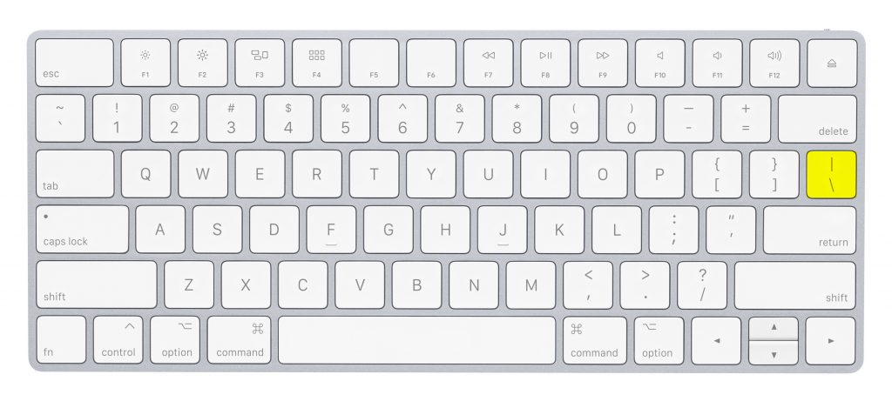

# PIPEX CHECKER

Following the Test Driver Design framework, tests are created before coding a new feature. The feature is deemed functional if it can pass all the tests. After passing all tests, take time to refactor code and improve its design without changing the behaviour. You may add new tests if new scenarios or edge cases are discovered during the development.

Therefore, PIPEX CHECKER is created as my acceptance test for the project PIPEX from 42 programme. It covers the following scenario

1. Program should return error if there is 0 argument

2. Program should return error if there is 1 argument

3. Program should return error if there is 2 argument

4. Program should return error if there is 3 argument

5. Program should create correct output file in normal flow 
e.g `./pipex infile cat "wc -w" outfile`

6. Program should return error if input file does not exist

7. Program should return error if output file exists and cannot be overwritten

8. Program should create correct output file if a user-created command is used 
e.g `./pipex infile ../mycmd1 "wc -w" outfile`

9. Program should create correct output file if command argument has double quotes 
e.g `./pipex infile cat 'grep "hello world"' outfile`

10. Program should create correct output file if command argument has double quotes and a user-created command is used

11. Program should return error if first command is not found

12. Program should return error if second command is not found

## How to use

1. Download pipex_checker folder to your computer

2. Copy your pipex executable file to pipex_checker folder

3. Run `./checker` inside pipe_checker folder

