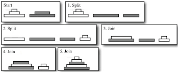
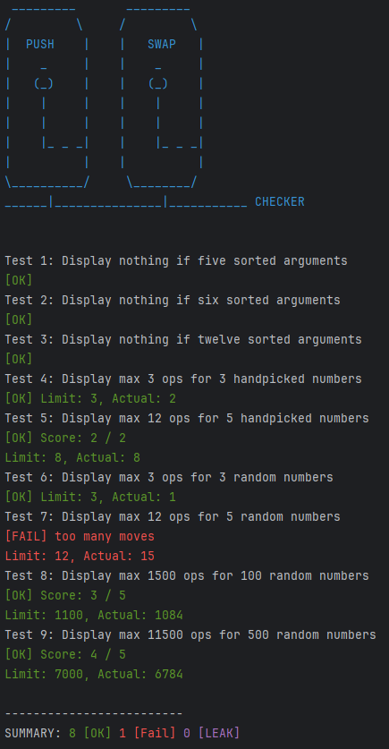

# PUSH_SWAP CHECKER

Following the Test Driven Design framework, tests are created before coding a new feature. The feature is deemed functional if it can pass all the tests. After passing all tests, take time to refactor code and improve its design without changing the behaviour. You may add new tests if new scenarios or edge cases are discovered during the development.

Therefore, PUSH_SWAP CHECKER is created as my acceptance test for the project [PUSH_SWAP](../pdf/push_swap/push_swap.pdf) from 42 programme. It covers the following scenario

1. Display Error if args contain alphabet
2. Display Error if args contain decimal
3. Display Error if args contain more than one dash
4. Display Error if args contain dash with no number
5. Display Error if args contain duplicate number
6. Display Error if args contain number larger than MAX_INT
7. Display Error if args contain number smaller than MIN_INT
8. Display nothing if args contain only MIN_INT
9. Display nothing if no arguments
10. Display nothing if one argument
11. Display nothing if 2 sorted arguments
12. Display nothing if 3 sorted arguments
13. Display nothing if 4 sorted arguments
14. Display nothing if 5 sorted arguments
15. Display nothing if 6 sorted arguments
16. Display nothing if 12 sorted arguments
17. Display max 3 ops for 3 handpicked numbers
18. Display max 12 ops for 5 handpicked numbers
19. Display max 3 ops for 3 random numbers
20. Display max 12 ops for 5 random numbers
21. Display max 1500 ops for 100 random numbers
22. Display max 11500 ops for 500 random numbers

## How to use

1. Download push_swap_checker folder to your computer

2. Copy your push_swap executable file to push_swap_checker folder

3. Run `./checker` inside push_swap_checker folder

## Preview

